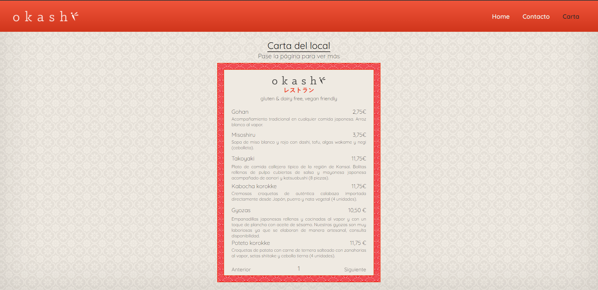

# Digital Restaurant #

**Author:** Héctor Ginory
 

**Tecnologies:** HTML5, CSS3, JavaScript - ES6, Git
 

<a href="https://hectorginory.github.io/DigitalRestaurant/">Click here to see the site</a>
 

## Challenge ##

The challenge was to recreate a restaurant card responsive page, with three sections:
 
- Home
- Contact
- Card
 

The theme was free. So I decide to do a rework of an original page.

I was looking for a japanese restaurant and I found 
<a href="https://www.okashisanda.com/">
    Okashi Group
</a>
page.

## How I made it ##

I started the proces by picking 4 colors for the palette of the page. An the set it in variables for css.

    --color-1: #ff7d00;
    --color-2: #efeae2;
    --color-3: #2D2827;
    --color-4: #ED3C1F;

After that I created the 3 pages and picking information from the original one, and I change all the styles.

### Home page ###
 

### Contact page ###
 

### Card page ###
 

 
Like I said the page it´s responsive, so 
<a href="https://hectorginory.github.io/DigitalRestaurant/">check it out!</a>